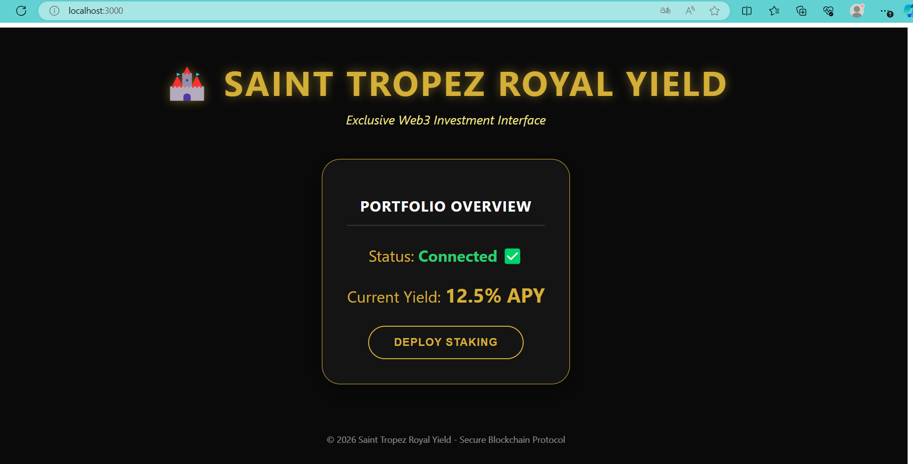

# 🏰 SAINT TROPEZ ROYAL YIELD VAULT

> **Repository:** `SAINT-TROPEZ-ROYAL-YIELD`

## 💎 Luxury Real Estate Fractionalization Protocol
**Tokenizing high-end properties in Saint-Tropez for fractional ownership.**


🌟 Overview

SAINT-TROPEZ-ROYAL-YIELD is a secure and compliant ERC-1155 smart contract engineered for the fractionalization of luxury real estate (Real World Assets - RWA).

The contract allows an Asset Manager to create digital tokens representing ownership shares in high-value properties, while a Security Officer manages investor whitelisting to ensure full regulatory compliance and KYC/AML standards.:



🛠️ Core Features
Fractionalize Assets: Create ERC-1155 tokens representing shares of luxury property (fractionalizeAsset).


Role-Based Access Control:

👑 DEFAULT_ADMIN_ROLE: Full protocol oversight.

💼 ASSET_MANAGER_ROLE: Authorized to mint and manage fractional assets.

🛡️ SECURITY_OFFICER_ROLE: Manages investor whitelisting.

Strict Whitelist Enforcement: Only KYC-approved investors can receive or transfer tokens.

Asset Metadata: Stores property name, valuation, and a default annual yield rate (5.5%) on-chain.

Security Standards: Built with OpenZeppelin's ReentrancyGuard and AccessControl.


🧪 Proven Success (Testing)
I have developed and thoroughly tested the core features using Foundry with a 100% success rate.

7/7 Unit Tests Passed

✅ Deployment & Roles: Verified correct initialization.

✅ Whitelist Logic: Confirmed investor management functionality.

✅ Fractionalization: Tested minting and metadata storage.

✅ Restricted Transfers: Ensured only whitelisted addresses can trade.

✅ Security Barriers: Blocked unauthorized transfer attempts.

✅ ID Collision: Prevented duplicate asset creation.

✅ Standard Compliance: Fully supports ERC-1155 + ERC-165.

Command: forge test -vv


🚀 Current Status & Roadmap
Current Status

✅ Contract is fully functional and tested

✅ All unit tests passing

✅ Ready for testnet deployment


## 🚀 Roadmap & Progress

I am actively developing this protocol. Here is the current status of the planned improvements:

* ✅ **Asset Management**: Implemented granular pausing/unpausing for specific asset IDs to handle maintenance or legal updates.
* ✅ Advanced Yield Distribution: Implemented proportional ETH-based profit sharing and automated calculation logic per asset holder.
* ✅ Core Protocol Development: ERC-1155 implementation and role management.
* ✅ Whitelisting System: Secure KYC-based transfer logic.
* ✅ Advanced Yield Logic: ETH-based distribution and claiming system.
* ✅ Advanced Testing: Implementation of Fuzzing and Invariant tests.

### 🚀 Deployment Info (Sepolia Testnet)
The smart contract has been successfully deployed and verified on the Ethereum Sepolia Test Network.
* **Project Name:** Saint Tropez Royal Yield Vault
* **Contract Address:** `0xfb51a79da1666879ea0724ec3bfeeb1d492529e5`
* **Explorer Link:** [View on Etherscan](https://sepolia.etherscan.io/address/0xfb51a79da1666879ea0724ec3bfeeb1d492529e5#code)
* **Status:** ✅ **Verified** (Public Source Code available)
## 🖥️ Live Dashboard Interface (Preview)

The screenshot above displays the actual working interface for investors. It is designed with a high-end, exclusive aesthetic, focusing on intuitive RWA (Real World Asset) interaction.

### Key Features of the V1.0 UI:

- **Secured Wallet Connection ✅:** Visual feedback confirms the investor's identity and wallet status.
- **Yield Monitoring:** Current Annual Percentage Yield (APY) tracking, calibrated for luxury assets.
- **On-chain Action Handling:** Simulated 'DEPLOY STAKING' functionality with user interaction feedback (Spinner and Alert).
- **2026 Ready:** Fully updated protocol compliance and design standards.

### 🚀 Nextsteps
* 🤖 **Automation**: Planned automated yield calculation and claiming via Chainlink Keepers.
* 🔍 **Audit Readiness**: Preparing full documentation for security audits.

---

## 🛠 Technical Features (Updated)

* **Fractionalization**: Divide high-value assets into ERC1155 tokens.
* **Access Control**: Different levels of permissions (Admin, Security Officer, Asset Manager).
* **Compliance**: Built-in whitelist system for KYC-verified investors.
* **Granular Security**: Ability to pause trading for individual assets without affecting the entire vault.

💻 Tech Stack
Language: Solidity ^0.8.20

Framework: Foundry (Forge)

Libraries: OpenZeppelin Contracts

Testing: Forge Std

📥 Quick Start
Bash

# 1. Install dependencies
forge install

# 2. Build the project
forge build

# 3. Run all tests
forge test -vv


### 🏗️ Protocol Architecture

```mermaid
graph TD
    Admin((👑 Admin)) -- "Grants Roles" --> Vault
    Manager((💼 Asset Manager)) -- "Mints Property Tokens" --> Vault
    Officer((🛡️ Security Officer)) -- "Whitelists Investors" --> Vault

    subgraph "Saint Tropez Royal Yield Vault (ERC-1155)"
        Vault{Smart Contract}
        Data[(On-Chain Metadata:<br/>Price, Yield 5.5%)]
        Rules{Compliance Logic}
    end

    InvestorA[👤 Investor A<br/>Whitelisted] -- "Can trade" --> Token((Token Share))
    InvestorB[👤 Investor B<br/>Whitelisted] -- "Can trade" --> Token
    NonAuth[❌ Unverified User] -- "BLOCKED" --> Token

    Vault --> Rules
    Rules --> Token
    Token --- Data

